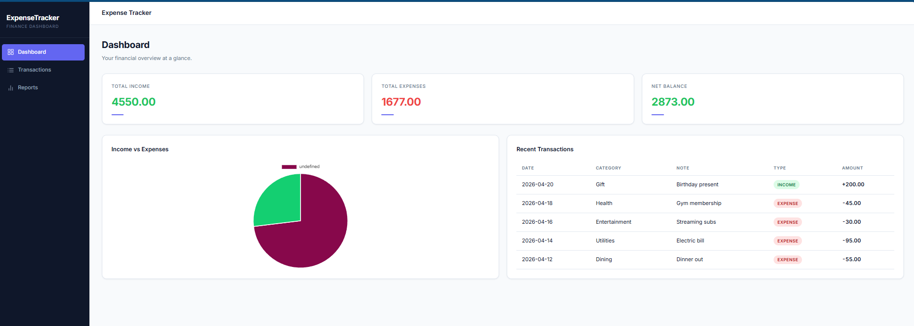
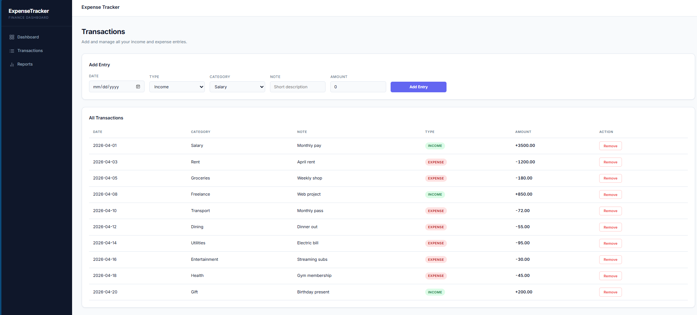
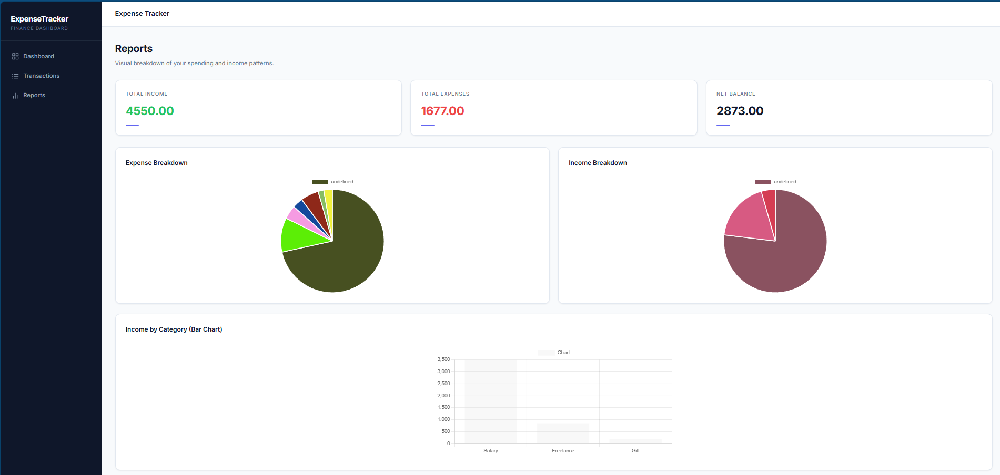

# ExpenseTracker Single Page App with F#

This is a Single Page Application built using F# and WebSharper. It is a personal finance management tool where users can track their income and expenses, view their net balance, and analyse spending patterns through interactive charts across three pages: Dashboard, Transactions, and Reports.

## Landing Page

- This is the Dashboard page (overview of income, expenses, and balance)



- This is the Transactions page (add and delete income/expense entries)



- This is the Reports page (charts and spending breakdown by category)



## Technologies Used

- [F# Software Foundation](https://fsharp.org) — for the F# language and community resources
- [WebSharper](https://websharper.com) — for the F# to JavaScript transpiler and UI framework
- [Chart.js](https://www.chartjs.org) — for the charting library used in the Reports page
- [Vite](https://vitejs.dev) — for the fast development server
- [Microsoft ASP.NET Core](https://dotnet.microsoft.com/en-us/apps/aspnet) — for the web hosting framework

## Project Structure

- **Client.fs**: Client-side code containing the SPA router, domain model, reactive state, chart helpers, and all three page renderers.
- **Startup.fs**: Server-side ASP.NET Core entry point and middleware setup.
- **wwwroot/index.html**: The main HTML shell template with page layouts and WebSharper template directives.
- **wsconfig.json**: WebSharper transpiler configuration (SPA mode, output directories).
- **vite.config.js**: Vite dev server configuration (port 27089).
- **esbuild.config.mjs**: Release bundler that minifies compiled JavaScript output.
- **ExpenseTracker.fsproj**: Project file with package references.

## Getting Started

To get a local copy up and running follow these simple steps.

### Prerequisites

Before you start, ensure you have the following installed:

- [.NET 9 SDK](https://dotnet.microsoft.com/download)
- [Node.js](https://nodejs.org/)

### Installation

1. Clone the repo
   ```sh
   git clone https://github.com/your-username/ExpenseTracker.git
   ```
2. Navigate to the project directory
   ```sh
   cd ExpenseTracker
   ```
3. Install npm dependencies
   ```sh
   npm install
   ```

## Usage

1. Open the project in your favorite code editor.
2. Build the project using the following command:
   ```sh
   dotnet build
   ```
3. Run the project:
   ```sh
   dotnet run
   ```

## What I Learned

- How to build a Single Page Application in **F#** using **WebSharper** and **WebSharper.UI**
- How to use **reactive state** (`Var<T>` and `View<T>`) to automatically update the UI when data changes
- How to implement **client-side routing** with hash-based URLs (`#/`, `#/transactions`, `#/reports`)
- How to bind **Chart.js** charts (pie and bar) through WebSharper's type-safe bindings
- How to use **WebSharper HTML templates** with directives like `ws-var`, `ws-onclick`, and `ws-hole`
- How to set up an **ASP.NET Core** backend to host a WebSharper SPA
- How to configure **Vite** as a dev server and **esbuild** for release bundling
